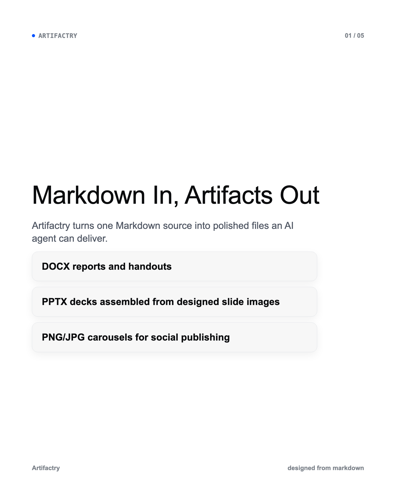
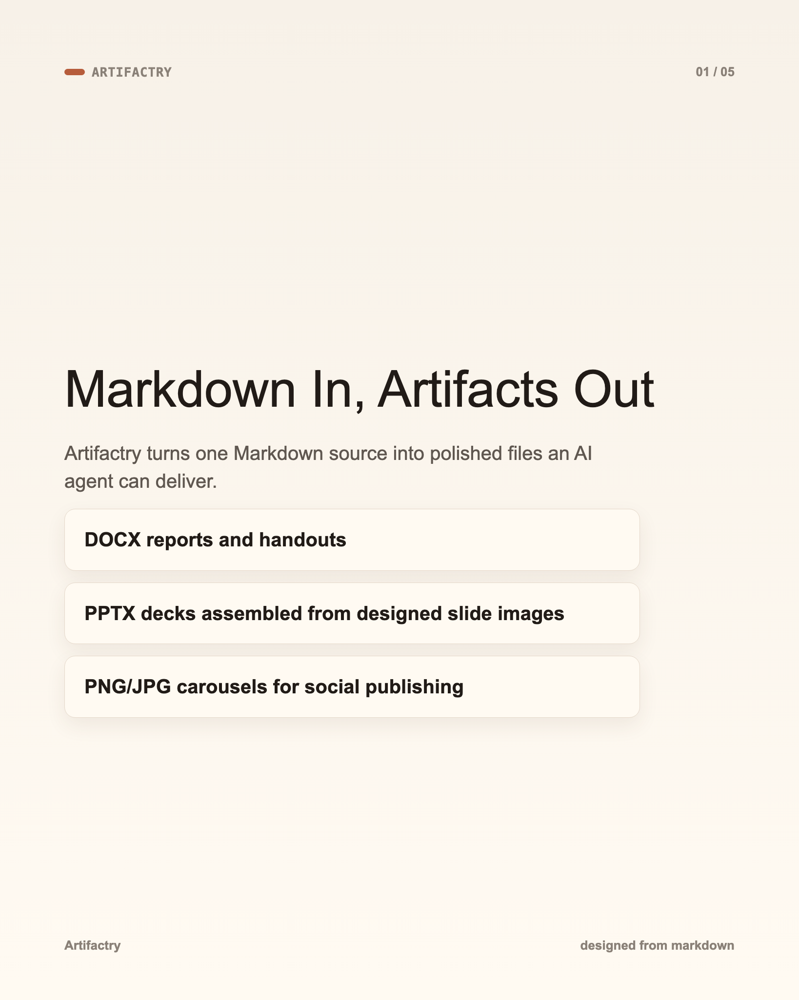
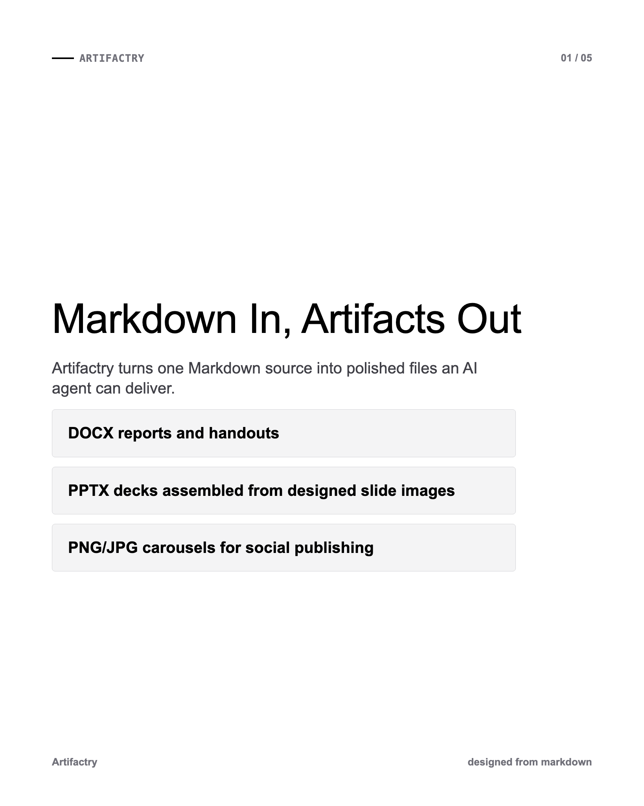
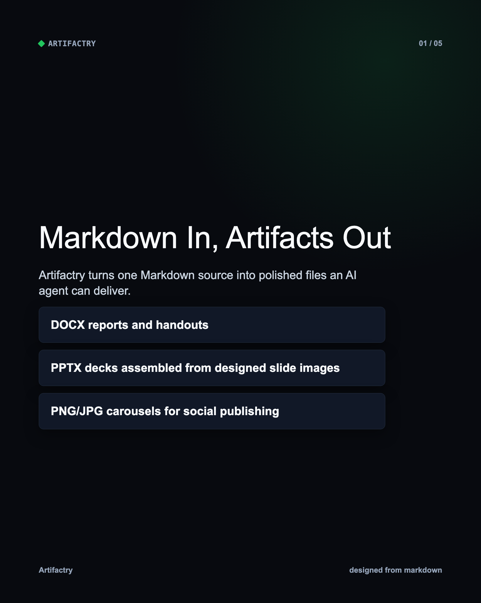
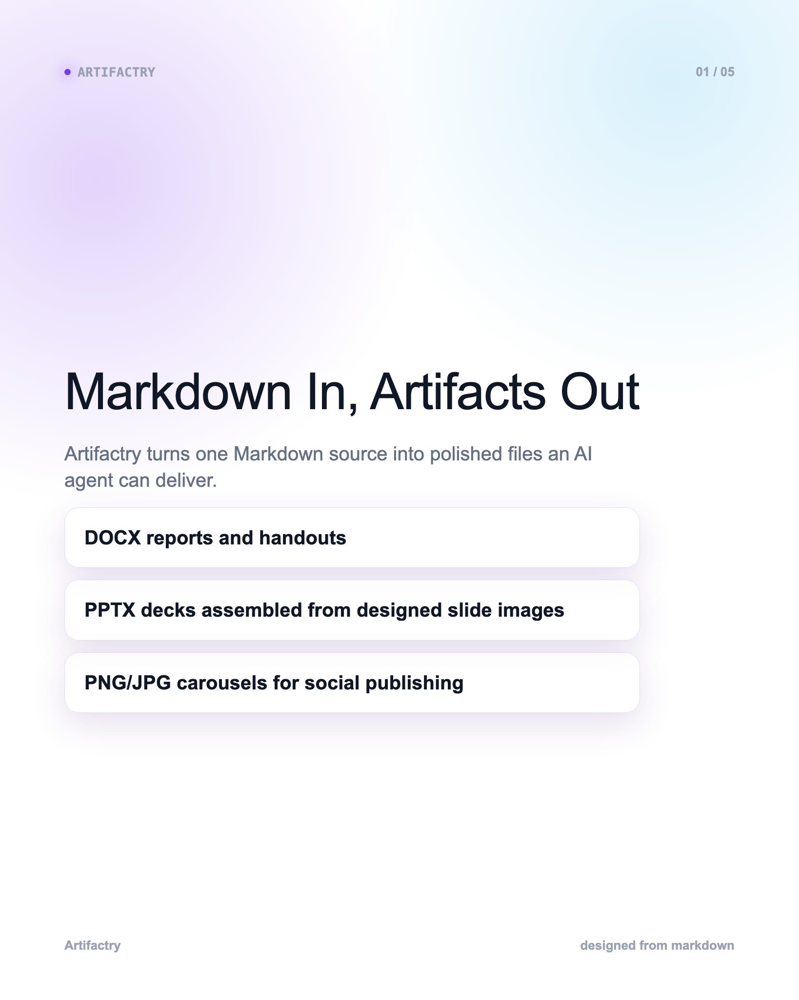
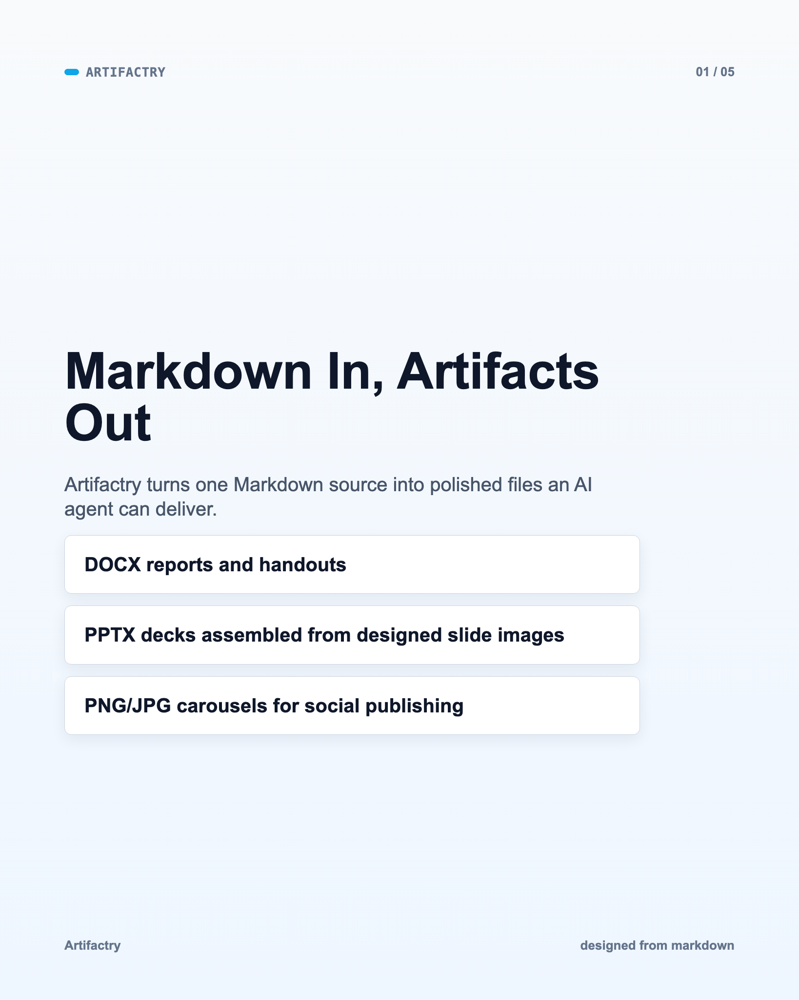
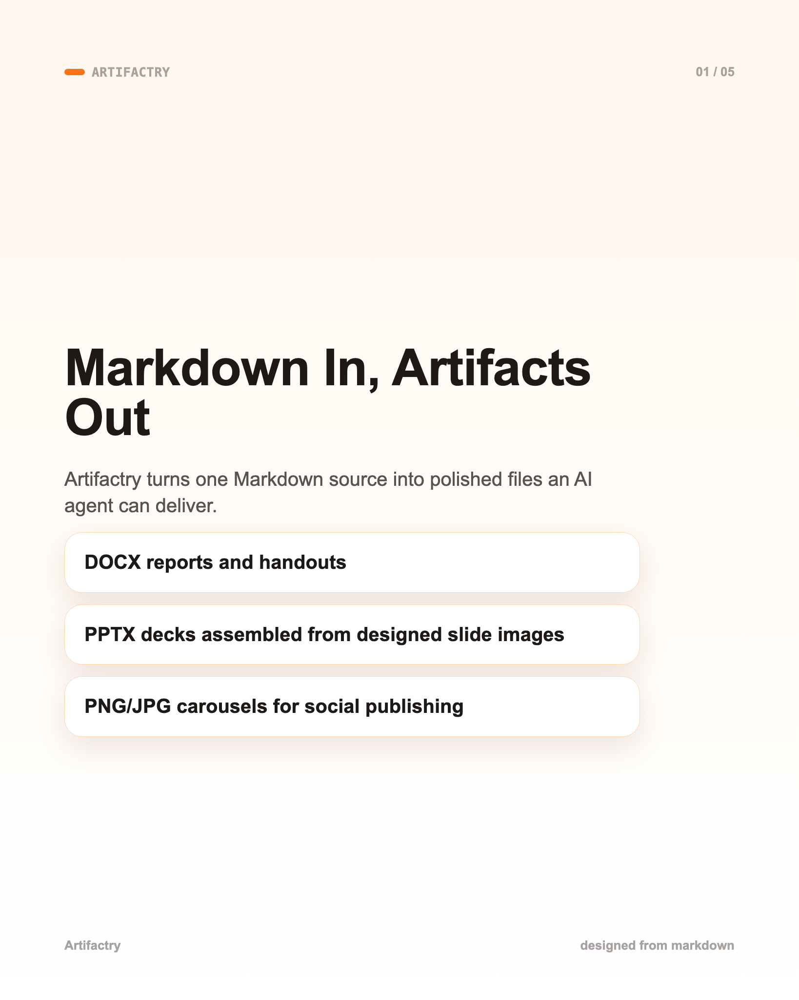
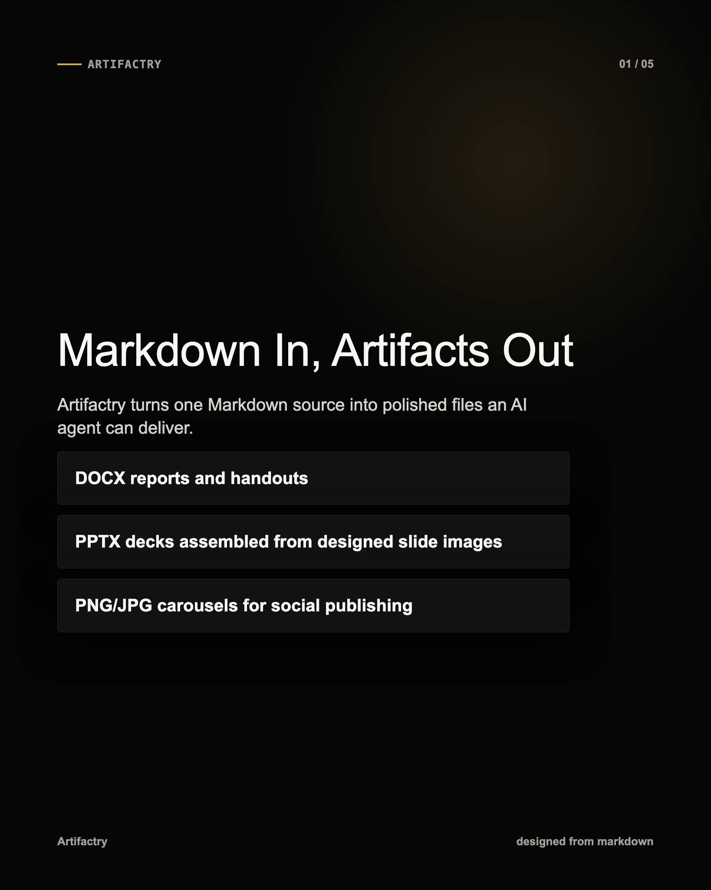
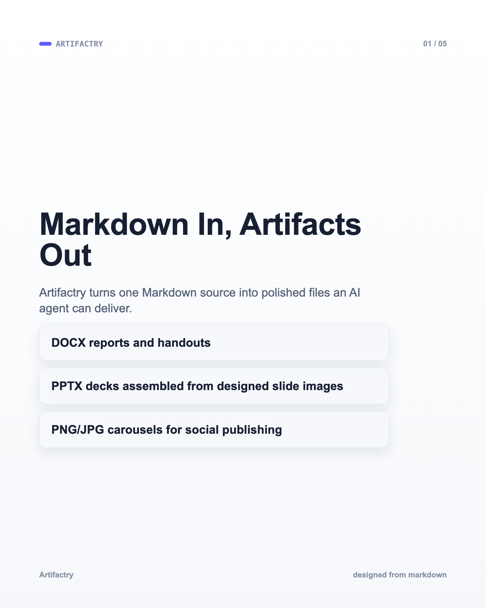
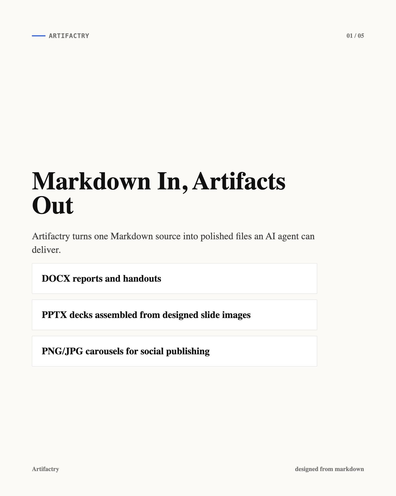

# Artifactry


Markdown in, polished artifacts out.

Artifactry turns Markdown into polished documents, decks, PDFs, and social images with AI agents using `DESIGN.md`-inspired style systems.

Artifactry is a public-ready skill pack for Claude Chat, Claude Desktop, Claude Code, OpenCode, Codex, and other coding agents. It helps an AI agent take a `.md` file and convert it into real deliverables:

- Word documents (`.docx`)
- PDFs (`.pdf`)
- PowerPoint decks (`.pptx`)
- Social carousel images (`.png`, `.jpg`)
- Multi-format bundles from the same Markdown source

The project is built around a simple idea: Markdown should be the source file, but the output should look intentional to share with stakeholders, print, or post online. The skill pack teaches agents to ask the right questions about output format, style, and size, then choose the right export route and validate the final files.

It also includes a Claude Code agent profile, `export-designer`, that runs an operating loop inspired by high-quality media-generation skill packs:

```text
diagnose -> ask -> search -> route -> refactor -> render -> validate -> deliver
```

## What Is It Used For?

Use this project when you want to turn Markdown into:

- Training handouts and worksheets
- Business reports and internal memos
- SOPs, documentation, and knowledge-base pages
- Pitch decks and workshop presentations
- LinkedIn or Instagram-style carousels
- PDF handouts for sharing or printing
- Multi-format content packs from one source

Example requests:

```text
Use Artifactry to turn this Markdown into a polished DOCX and PDF.
```

```text
Use Artifactry to create a 16:9 presentation and PNG slide images from this bootcamp outline.
```

```text
Use Artifactry with Broadsheet Analysis style to create a 4:5 social carousel from this Markdown.
```

## Install

### Ask An Agent

```text
Install Artifactry for Claude Code. Run:
claude plugin marketplace add https://github.com/jeremy193a/md-to-artifacts.git
claude plugin install md-export-skills@md-export-skills
Then restart Claude Code and verify /artifactry appears in /help.
```

For an export task, tell the agent:

```text
Run python scripts/check_requirements.py. If anything is missing, ask before installing system tools. Then use Artifactry to export my Markdown into the requested files and validate the outputs.
```

### Claude Chat/Desktop

1. Open Claude Chat or Claude Desktop.
2. Make sure code execution is enabled in `Settings` -> `Capabilities` if Skills are not visible.
3. Go to `Customize` -> `Skills`.
4. Click `+` -> `Create skill`.
5. Choose `Upload a skill`.
6. Upload `dist/artifactry.zip`.
7. Toggle the skill on.
8. Start a new chat and ask Claude to use the Artifactry skill.

If you cloned the repo locally, the full upload path is:

```text
clone repo -> run package script -> upload dist/artifactry.zip -> toggle skill on
```

Package command:

```bash
python scripts/package_claude_skill.py
```

Example Claude Chat prompt:

```text
Use the Artifactry skill. I uploaded a Markdown file. Ask me which output format, style, and size I want, then export and validate the files.
```

### Claude Code

Claude Code uses plugins through marketplaces:

```text
/plugin marketplace add https://github.com/jeremy193a/md-to-artifacts.git
/plugin install md-export-skills@md-export-skills
```

After installing, restart Claude Code, then use:

```text
/artifactry examples/showcase/board-brief.md as a 16:9 PPTX and PNG deck using Institutional Clarity
```

Alias:

```text
/md-artifacts examples/showcase/board-brief.md as a 16:9 PPTX and PNG deck using Institutional Clarity
```

Update an installed version after this repo publishes a new commit:

```text
/plugin marketplace update md-export-skills
/plugin update md-export-skills@md-export-skills
```

Terminal equivalent:

```bash
claude plugin marketplace update md-export-skills
claude plugin update md-export-skills@md-export-skills
```

Restart Claude Code after updating so new commands, agents, and skills are loaded.

For local development:

```bash
claude --plugin-dir .
```

See [CLAUDE.md](CLAUDE.md).

### Codex / Local Skills

Symlink the skill folder:

```bash
mkdir -p ~/.codex/skills
ln -s /path/to/md-export-skills/skills/artifactry ~/.codex/skills/artifactry
```

Or copy it:

```bash
cp -R /path/to/md-export-skills/skills/artifactry ~/.codex/skills/
```

See [CODEX.md](CODEX.md) and [OPENCODE.md](OPENCODE.md).

## Requirements

Users should not have to manually reason through dependencies. Ask the agent to run the preflight first:

```bash
python scripts/check_requirements.py
```

The script tells the agent which packages or system tools are missing and prints install commands. The agent should ask for approval before installing system tools.

Agent install prompt:

```text
Run python scripts/check_requirements.py. If Python packages are missing, install them with python3 -m pip install -r requirements.txt. If system tools are missing, ask me for approval, then install only the tools required for my requested output.
```

What Artifactry may need:

- Python packages from `requirements.txt` for DOCX/PPTX/image handling.
- Pandoc for DOCX/PDF/PPTX conversion routes.
- Google Chrome or Chromium for PNG/JPG rendering.
- Node/npm only when fetching external `DESIGN.md` styles with `npx getdesign@latest add <style>`.
- LaTeX/XeLaTeX only for Pandoc PDF routes that require LaTeX.

## Markdown Conventions

### Doctype

Use `doctype` in frontmatter to tell the agent what the Markdown should become:

```yaml
---
title: "AI Training Bootcamp"
doctype: "slides"
outputs: ["pptx", "png"]
style: "institutional-clarity"
aspect: "16:9"
---
```

Supported doctypes:

- `document`: Word/PDF reports, worksheets, proposals, SOPs, handouts
- `slides`: presentation decks
- `carousel`: social image sequences
- `docs`: documentation or knowledge-base content

### Includes / Partials

Split large projects into smaller files:

```markdown
# AI Training Bootcamp

{{ include: sections/module-1.md }}

{{ include: sections/module-2.md }}

{{ include: sections/workshop.md }}
```

The scripts expand includes before exporting. This lets one master Markdown file control a full course, deck, or document while each section stays editable.

## Features

- Claude Chat custom Skill ZIP support
- Claude Code plugin structure
- Claude Code `/artifactry` slash command plus `/md-artifacts` alias
- Claude Code `export-designer` agent operating loop
- Agent preflight for Python packages and system tools
- Local searchable export-pattern corpus
- Local skill support for Codex/OpenCode-style agents
- Markdown frontmatter routing with `doctype`
- Include/partial expansion with `{{ include: path.md }}`
- DOCX export with generated `reference.docx`
- HTML/CSS fixed-canvas slide rendering
- PNG/JPG export through Chrome/Chromium
- PPTX assembly from rendered images
- PDF-ready document/deck workflows
- `DESIGN.md` and getdesign.md style adaptation
- Aspect ratios: `16:9`, `4:5`, `1:1`, `9:16`, `A4`, `Letter`, custom
- Vietnamese-friendly deterministic text rendering
- Output validation for DOCX, PPTX, PDF, PNG, and JPG

## Style Database

Artifactry now has two style layers:

- Markdown style guides: detailed creative direction for agents.
- JSON token fallbacks: deterministic tokens for scripts and simple rendering routes.

The primary public style guides live in:

```text
skills/artifactry/references/style-guides/
```

These 15 guides are synthesized from the local getdesign.md corpus. They are not brand names:

- **Regulated Ledger** (`regulated-ledger`): trust-first executive, finance, board, and risk artifacts.
- **Human Workshop** (`human-workshop`): training, education, workbooks, and practical enablement.
- **Swiss Protocol** (`swiss-protocol`): strict monochrome technical memos, specs, and founder briefs.
- **Terminal Operator** (`terminal-operator`): agent workflows, API guides, code-first decks, and automation playbooks.
- **Aurora Product** (`aurora-product`): luminous AI/product launches and feature announcements.
- **Metrics Command** (`metrics-command`): KPI reviews, analytics, dashboards, and operating reports.
- **Broadsheet Intelligence** (`broadsheet-intelligence`): research, market analysis, thought leadership, and editorial carousels.
- **Black Label Cinema** (`black-label-cinema`): premium dark hero decks, portfolio stories, and high-stakes pitches.
- **Playful Systems** (`playful-systems`): SaaS onboarding, internal tools, friendly workflow explainers.
- **Image Market** (`image-market`): photo-led social stories, campaigns, catalogs, and product narratives.
- **Spatial Canvas** (`spatial-canvas`): workshop maps, brainstorms, process maps, and collaboration boards.
- **Blueprint Infra** (`blueprint-infra`): architecture, infrastructure, API maps, and engineering strategy.
- **Commerce Editorial** (`commerce-editorial`): retail, catalog, offer, product, and brand explainers.
- **Motion Premiere** (`motion-premiere`): creative AI, media launches, trailer-like decks, and storyboard narratives.
- **Performance Machine** (`performance-machine`): automotive, hardware, sport, industrial, and high-performance demos.

Style token fallback files live in:

```text
skills/artifactry/styles/
```

List guides and token fallbacks from the command line:

```bash
python skills/artifactry/scripts/list_styles.py
```

The crawled `DESIGN.md` files are used as an inheritance corpus, not as public brand style names. Artifactry exposes generic archetypes so users can choose by mood, artifact type, and communication goal without copying brand names.

Artifactry can also adapt a local `DESIGN.md` or fetch one with:

```bash
npx getdesign@latest add <style-name>
```

## Showcase

Artifactry uses its own project story as the showcase source. This keeps the examples honest: the DOCX showcase is this README converted to Word, and the PPTX showcase is a carousel explaining Artifactry itself.

Build the signature style gallery:

```bash
python scripts/build_signature_showcase.py
```

Build the token fallback route showcase:

```bash
python scripts/build_showcase.py
```

What it creates:

- `scripts/build_signature_showcase.py` -> `assets/showcase/signature/<style>/slide-01.png`
- `README.md` -> `output/showcase/docx/artifactry-readme-<style>.docx`
- `examples/showcase/artifactry-carousel.md` -> `assets/showcase/styles/<style>/slide-*.png`
- `assets/showcase/styles/<style>/slide-*.png` -> `output/showcase/pptx/artifactry-<style>.pptx`

The `output/` folder is intentionally gitignored because generated Office files are large. The PNG previews below are checked in so people can inspect the visual range quickly.

### Signature Style Gallery

These previews are built from the 15 Markdown style guides. Each guide gets its own composition pattern instead of reusing one generic template.

| Regulated Ledger | Human Workshop | Swiss Protocol |
|---|---|---|
|  |  |  |

| Terminal Operator | Aurora Product | Metrics Command |
|---|---|---|
|  |  |  |

| Broadsheet Intelligence | Black Label Cinema | Playful Systems |
|---|---|---|
|  |  |  |

| Image Market | Spatial Canvas | Blueprint Infra |
|---|---|---|
|  |  |  |

| Commerce Editorial | Motion Premiere | Performance Machine |
|---|---|---|
|  |  |  |

### Token Preview Gallery

These previews exercise the deterministic JSON token fallback renderer.

| Style | Preview |
|---|---|
| Institutional Clarity |  |
| Warm Editorial |  |
| Monochrome Precision |  |
| Dark Console |  |
| Gradient Intelligence |  |
| Data Command |  |
| Visual Lifestyle |  |
| Cinematic Luxury |  |
| Playful Productivity |  |
| Broadsheet Analysis |  |

Showcase Markdown input:

- [examples/showcase/artifactry-carousel.md](examples/showcase/artifactry-carousel.md)

Build a single style manually:

```bash
python scripts/build_showcase.py --styles institutional-clarity
```

## Additional Examples

These examples are kept for route testing beyond the project showcase.

### Worksheet To DOCX

Input:

[examples/training-handout/worksheet.md](examples/training-handout/worksheet.md)

Command:

```bash
python skills/artifactry/scripts/normalize_markdown.py \
  examples/training-handout/worksheet.md \
  --worksheet-lines \
  --output build/worksheet.normalized.md

python skills/artifactry/scripts/build_reference_docx.py \
  --output build/reference.docx \
  --company "AI Training" \
  --style warm-editorial

pandoc build/worksheet.normalized.md \
  --from=markdown \
  --to=docx \
  --reference-doc=build/reference.docx \
  --output output/worksheet.docx

python skills/artifactry/scripts/validate_exports.py output/worksheet.docx
```

Output:

```text
OK output/worksheet.docx
```

### Markdown To 16:9 PPTX

Input:

[examples/presentation/bootcamp-outline.md](examples/presentation/bootcamp-outline.md)

Command:

```bash
python skills/artifactry/scripts/render_html_deck.py \
  examples/presentation/bootcamp-outline.md \
  --aspect 16:9 \
  --style institutional-clarity \
  --output-dir build/bootcamp-16x9

python skills/artifactry/scripts/render_images_chrome.py \
  build/bootcamp-16x9/slides-html \
  --aspect 16:9 \
  --output-dir output/bootcamp-16x9/png

python skills/artifactry/scripts/build_pptx_from_images.py \
  output/bootcamp-16x9/png \
  --aspect 16:9 \
  --output output/bootcamp-16x9/bootcamp.pptx

python skills/artifactry/scripts/validate_exports.py \
  output/bootcamp-16x9/png \
  output/bootcamp-16x9/bootcamp.pptx
```

Output:

```text
OK output/bootcamp-16x9/png
OK output/bootcamp-16x9/bootcamp.pptx
```

### Modular Deck With Includes

Input:

[tests/fixtures/master-with-includes.md](tests/fixtures/master-with-includes.md)

```markdown
# Include Test Deck

{{ include: sections/slide-one.md }}

{{ include: sections/slide-two.md }}
```

The renderer expands both partials before creating the slide deck.

## Project Structure

```text
md-export-skills/
├── skills/artifactry/
│   ├── SKILL.md
│   ├── agents/openai.yaml
│   ├── corpus/
│   ├── references/
│   └── scripts/
├── examples/
├── assets/showcase/
├── commands/artifactry.md
├── commands/md-artifacts.md
├── tests/
├── .claude/agents/export-designer.md
├── .claude-plugin/
├── AGENTS.md
├── CLAUDE.md
├── CLAUDE_CHAT.md
├── CODEX.md
├── OPENCODE.md
└── README.md
```

## Status

Public alpha. The DOCX, HTML-slide, PNG/JPG render, PPTX-from-images, include expansion, and validation routes are working. Agents can replace the default HTML renderer with richer project-specific layouts while keeping the same validation and assembly pipeline.

## License

MIT

## Credits

This project is inspired by [getdesign.md](https://getdesign.md/) and the public [VoltAgent/awesome-design-md](https://github.com/VoltAgent/awesome-design-md) collection. Their detailed `DESIGN.md` files helped shape the style inheritance model used by Artifactry.
