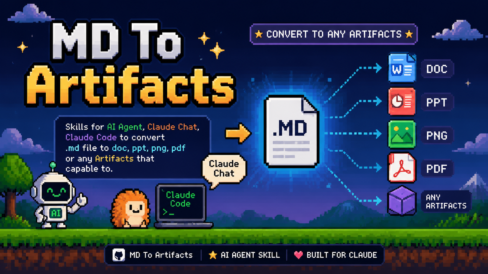

# MD Export Skills



Turn Markdown into polished documents, decks, PDFs, and social images with AI agents.

MD Export Skills is a public-ready skill pack for Claude Chat, Claude Code, OpenCode, Codex, and other coding agents. It helps an AI agent take a `.md` file and export it into real deliverables:

- Word documents (`.docx`)
- PDFs (`.pdf`)
- PowerPoint decks (`.pptx`)
- Social carousel images (`.png`, `.jpg`)
- Multi-format bundles from the same Markdown source

The project is built around a simple idea: Markdown should be the source file, but the output should look intentional.

It also includes a Claude Code agent profile, `export-designer`, that runs an operating loop inspired by high-quality media-generation skill packs:

```text
diagnose -> ask -> search -> route -> refactor -> render -> validate -> deliver
```

## What Is This Project?

MD Export Skills is an agent workflow plus a set of scripts for converting Markdown into designed export files.

Instead of asking an AI agent to “just convert this Markdown,” the skill teaches the agent to:

1. Understand what the Markdown is meant to become.
2. Ask which output, style, and size the user wants.
3. Apply a visual style system, including `DESIGN.md` files from [getdesign.md](https://getdesign.md/).
4. Export through the right pipeline.
5. Validate the final files before delivery.

It works best when the user wants a practical output, not just raw Markdown rendering.

## What Is It Used For?

Use this project when you want to turn Markdown into:

- Training handouts and worksheets
- Business reports and internal memos
- SOPs, documentation, and knowledge-base pages
- Pitch decks and workshop presentations
- LinkedIn or Instagram-style carousels
- PDF handouts for sharing or printing
- Multi-format content packs from one source

Example requests:

```text
Use MD Export Suite to turn this Markdown into a polished DOCX and PDF.
```

```text
Use MD Export Suite to create a 16:9 presentation and PNG slide images from this bootcamp outline.
```

```text
Use MD Export Suite with Broadsheet Analysis style to create a 4:5 social carousel from this Markdown.
```

## How It Works

The skill starts by asking for an export brief when details are missing:

```text
Before I export, choose the target:
1. Output: DOCX, PDF, PPTX, PNG/JPG carousel, or bundle?
2. Style: Institutional Clarity, Warm Editorial, Monochrome Precision, Dark Console, Gradient Intelligence, Data Command, Visual Lifestyle, Cinematic Luxury, Playful Productivity, Broadsheet Analysis, or local DESIGN.md?
3. Size: A4/Letter, 16:9, 4:5, 1:1, 9:16, or custom?
4. Priority: editable file, final polished visual, or both?
```

Then the agent chooses the correct route:

```text
Markdown -> normalized Markdown -> reference.docx -> DOCX/PDF
Markdown -> HTML/CSS fixed canvas -> PNG/JPG -> PPTX
Markdown -> slide plan -> styled deck/carousel -> validated exports
```

## Markdown Conventions

### Doctype

Use `doctype` in frontmatter to tell the agent what the Markdown should become:

```yaml
---
title: "AI Training Bootcamp"
doctype: "slides"
outputs: ["pptx", "png"]
style: "institutional-clarity"
aspect: "16:9"
---
```

Supported doctypes:

- `document`: Word/PDF reports, worksheets, proposals, SOPs, handouts
- `slides`: presentation decks
- `carousel`: social image sequences
- `docs`: documentation or knowledge-base content

### Includes / Partials

Split large projects into smaller files:

```markdown
# AI Training Bootcamp

{{ include: sections/module-1.md }}

{{ include: sections/module-2.md }}

{{ include: sections/workshop.md }}
```

The scripts expand includes before exporting. This lets one master Markdown file control a full course, deck, or document while each section stays editable.

## Features

- Claude Chat custom Skill ZIP support
- Claude Code plugin structure
- Claude Code `export-designer` agent operating loop
- Local searchable export-pattern corpus
- Local skill support for Codex/OpenCode-style agents
- Markdown frontmatter routing with `doctype`
- Include/partial expansion with `{{ include: path.md }}`
- DOCX export with generated `reference.docx`
- HTML/CSS fixed-canvas slide rendering
- PNG/JPG export through Chrome/Chromium
- PPTX assembly from rendered images
- PDF-ready document/deck workflows
- `DESIGN.md` and getdesign.md style adaptation
- Aspect ratios: `16:9`, `4:5`, `1:1`, `9:16`, `A4`, `Letter`, custom
- Vietnamese-friendly deterministic text rendering
- Output validation for DOCX, PPTX, PDF, PNG, and JPG

## Install

### Claude Chat

Claude Chat is the primary user path.

Package the skill:

```bash
python scripts/package_claude_skill.py
```

Upload the generated ZIP:

```text
dist/md-export-suite.zip
```

In Claude Chat:

1. Go to `Customize` -> `Skills`.
2. Click `+` -> `Create skill`.
3. Choose `Upload a skill`.
4. Upload `dist/md-export-suite.zip`.
5. Toggle the skill on.

See [CLAUDE_CHAT.md](CLAUDE_CHAT.md) for prompts and user guidance.

### Claude Code

Claude Code uses plugins through marketplaces:

```text
/plugin marketplace add owner/repo
/plugin install md-export-skills@md-export-skills
```

For local development:

```bash
claude --plugin-dir .
```

See [CLAUDE.md](CLAUDE.md).

### Codex / Local Skills

Symlink the skill folder:

```bash
mkdir -p ~/.codex/skills
ln -s /path/to/md-export-skills/skills/md-export-suite ~/.codex/skills/md-export-suite
```

Or copy it:

```bash
cp -R /path/to/md-export-skills/skills/md-export-suite ~/.codex/skills/
```

See [CODEX.md](CODEX.md) and [OPENCODE.md](OPENCODE.md).

## Requirements

Core Python packages:

```bash
pip install -r requirements.txt
```

Recommended system tools:

- Pandoc for DOCX/PDF/PPTX conversion routes
- Google Chrome or Chromium for PNG/JPG rendering
- Node/npm when using `npx getdesign@latest add <style>`

Optional:

- LaTeX/XeLaTeX for Pandoc PDF workflows

## Style Database

The project includes 10 generic style archetypes derived from research across the getdesign.md directory. These are not brand names:

- **Institutional Clarity** (`institutional-clarity`): trustworthy, precise, white-canvas system for executive, financial, and strategy exports.
- **Warm Editorial** (`warm-editorial`): human, thoughtful reading experience for handouts, training, essays, and course material.
- **Monochrome Precision** (`monochrome-precision`): black-and-white technical minimalism for developer docs and precise decks.
- **Dark Console** (`dark-console`): terminal-native dark surfaces for code-first workflows, APIs, and dev tooling.
- **Gradient Intelligence** (`gradient-intelligence`): luminous AI/product launch style with controlled gradients.
- **Data Command** (`data-command`): dense analytical dashboard language for metrics and operating reviews.
- **Visual Lifestyle** (`visual-lifestyle`): photo-led, friendly, consumer-facing system for campaigns and social stories.
- **Cinematic Luxury** (`cinematic-luxury`): dramatic black-canvas premium style for hero decks and portfolio narratives.
- **Playful Productivity** (`playful-productivity`): friendly modular SaaS language with approachable UI rhythm.
- **Broadsheet Analysis** (`broadsheet-analysis`): editorial magazine density with serif display and research-led layouts.

Style token files live in:

```text
skills/md-export-suite/styles/
```

List styles from the command line:

```bash
python skills/md-export-suite/scripts/list_styles.py
```

## getdesign.md Support

This project can use [getdesign.md](https://getdesign.md/) to bring in reusable style systems.

Example:

```bash
npx getdesign@latest add <style-name>
```

The skill can read a local `DESIGN.md` and translate the mood into export tokens:

- Word/PDF styles: headings, tables, spacing, headers/footers
- Deck styles: canvas, typography, cards, tables, footer, rhythm
- Image styles: ratio, safe margin, text scale, color, compression

## Showcase

### 1. Worksheet To DOCX

Input:

[examples/training-handout/worksheet.md](examples/training-handout/worksheet.md)

Command:

```bash
python skills/md-export-suite/scripts/normalize_markdown.py \
  examples/training-handout/worksheet.md \
  --worksheet-lines \
  --output build/worksheet.normalized.md

python skills/md-export-suite/scripts/build_reference_docx.py \
  --output build/reference.docx \
  --company "AI Training" \
  --style warm-editorial

pandoc build/worksheet.normalized.md \
  --from=markdown \
  --to=docx \
  --reference-doc=build/reference.docx \
  --output output/worksheet.docx

python skills/md-export-suite/scripts/validate_exports.py output/worksheet.docx
```

Output:

```text
OK output/worksheet.docx
```

### 2. Markdown To 16:9 PPTX

Input:

[examples/presentation/bootcamp-outline.md](examples/presentation/bootcamp-outline.md)

Command:

```bash
python skills/md-export-suite/scripts/render_html_deck.py \
  examples/presentation/bootcamp-outline.md \
  --aspect 16:9 \
  --style institutional-clarity \
  --output-dir build/bootcamp-16x9

python skills/md-export-suite/scripts/render_images_chrome.py \
  build/bootcamp-16x9/slides-html \
  --aspect 16:9 \
  --output-dir output/bootcamp-16x9/png

python skills/md-export-suite/scripts/build_pptx_from_images.py \
  output/bootcamp-16x9/png \
  --aspect 16:9 \
  --output output/bootcamp-16x9/bootcamp.pptx

python skills/md-export-suite/scripts/validate_exports.py \
  output/bootcamp-16x9/png \
  output/bootcamp-16x9/bootcamp.pptx
```

Output:

```text
OK output/bootcamp-16x9/png
OK output/bootcamp-16x9/bootcamp.pptx
```

### 3. Modular Deck With Includes

Input:

[tests/fixtures/master-with-includes.md](tests/fixtures/master-with-includes.md)

```markdown
# Include Test Deck

{{ include: sections/slide-one.md }}

{{ include: sections/slide-two.md }}
```

The renderer expands both partials before creating the slide deck.

## Project Structure

```text
md-export-skills/
├── skills/md-export-suite/
│   ├── SKILL.md
│   ├── agents/openai.yaml
│   ├── corpus/
│   ├── references/
│   └── scripts/
├── examples/
├── tests/
├── .claude/agents/export-designer.md
├── .claude-plugin/
├── AGENTS.md
├── CLAUDE.md
├── CLAUDE_CHAT.md
├── CODEX.md
├── OPENCODE.md
└── README.md
```

## Status

Public alpha. The DOCX, HTML-slide, PNG/JPG render, PPTX-from-images, include expansion, and validation routes are working. Agents can replace the default HTML renderer with richer project-specific layouts while keeping the same validation and assembly pipeline.

## License

MIT
